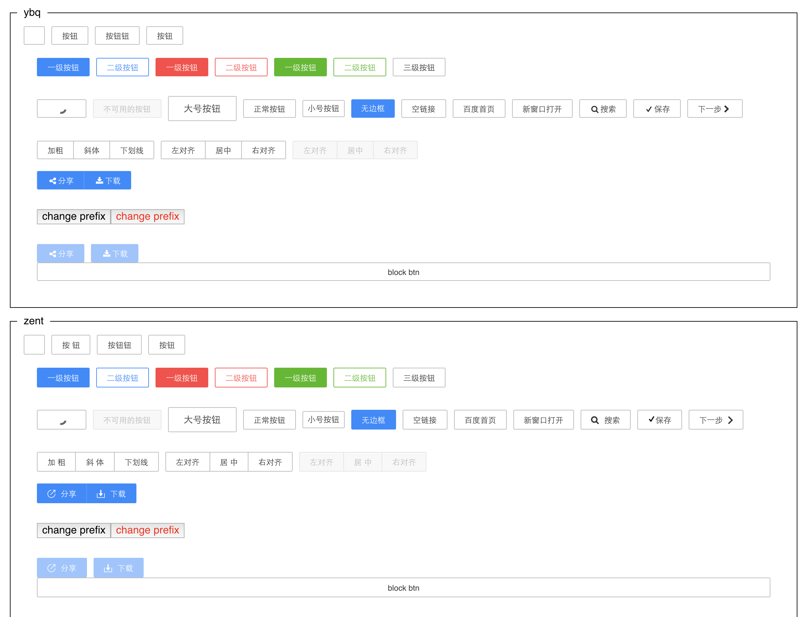
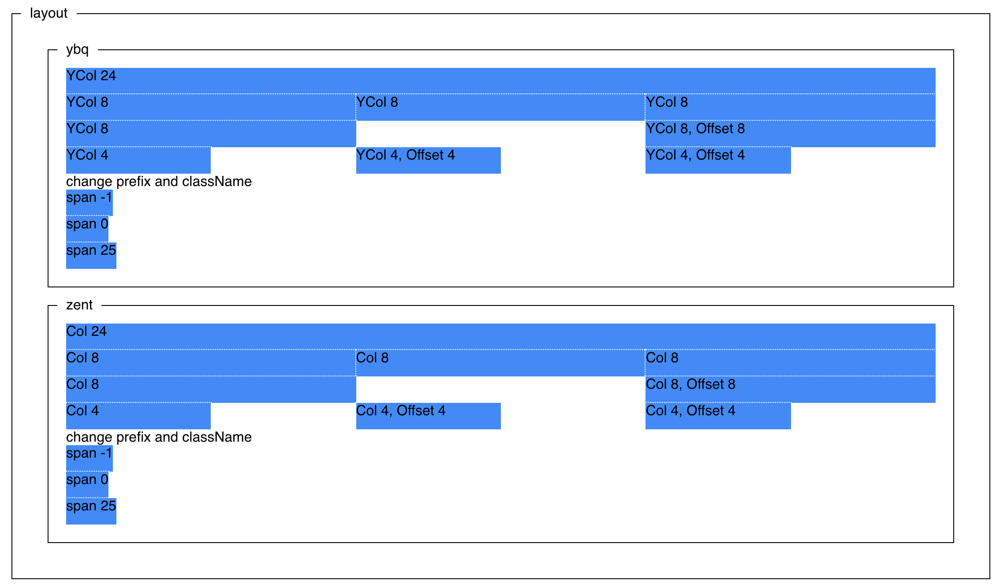

## shiye-ui

一个失业人员开发的桌面端UI库, 基于React

### 缘起

> 面试官: 没有开发过组件库?

> 我: 没有 orz

为什么早没想到做一个组件库呢!!!

现在做也不晚. 视觉和交互照抄 [**zent**](https://youzan.github.io/zent/)

### 进度
- done Button组件;
- done Icon组件弄了几个最简单的;
- done Layout
- done postcss (暂时加个 autoprefixer 功能)
- building... Form 及其依赖的组件
  - Form.InputField
  - Pop
  - Input
    - autoFocus
    - autoSelect
    - width
    - initSelectionStart
    - initSelectionEnd
    - autoSize

### 效果截图

